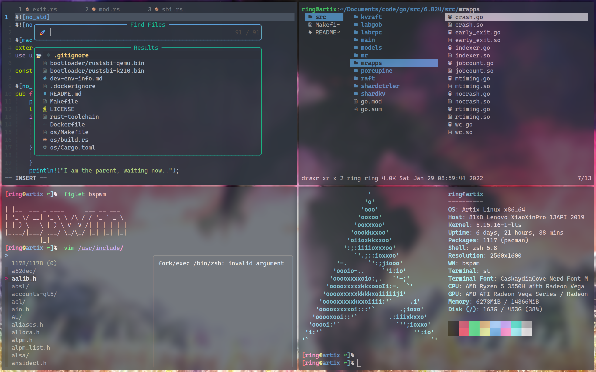
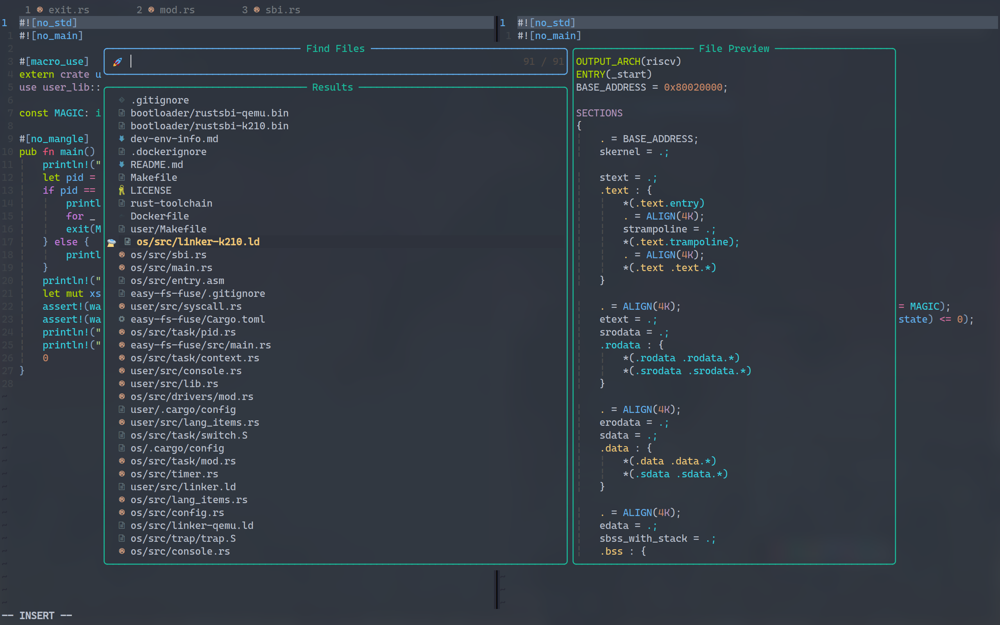
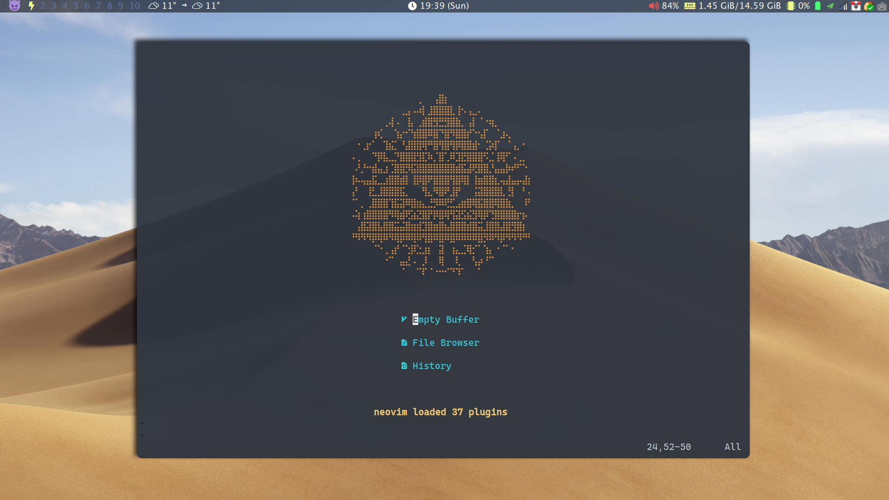

# My dotfiles

## Screenshots

Bspwm</img>

Work Flow</img>

vim</img>

## Install

- `./install.sh`

## My config

- neovim
    * I'm using neovim now. If you want a vim version `ln -s ./nvim ~/.vim` and `ln -s ./nvim/init.vim ~/.vimrc` may help
- zsh
    * vi-mode
    * syntax-highlighting
    * fzf
        + `<Ctrl-r>` fzf-history-widget             
        + `<Ctrl-t>` fzf-cd-widget      
        + `<Ctrl-p>` fzf-find-widget
        + `<Ctrl-f>` find-in-file
    * fzf-tab
        + `<tab>` to expand
        + `<shift> + <\>` to multi-select
    * auto-pair
- lf
- bspwm
- polybar
    * `super + p` to toggle polybar(auto hide after 5s). [script repo](https://github.com/66RING/scripts) is needed
- mpv
    * plugins
        + `<shift> + <enter>`to pop up mpv-playlistmanager
        + \` key to pop up mpv-recent
- ...

