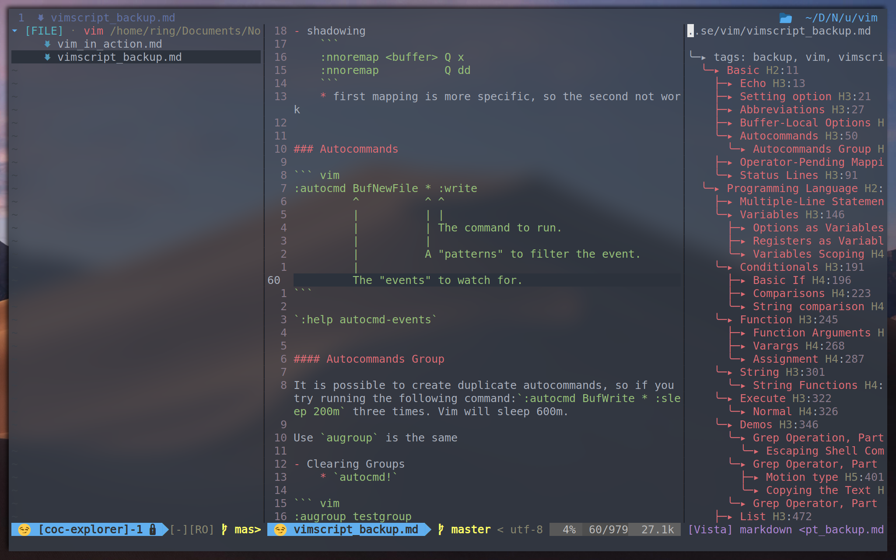
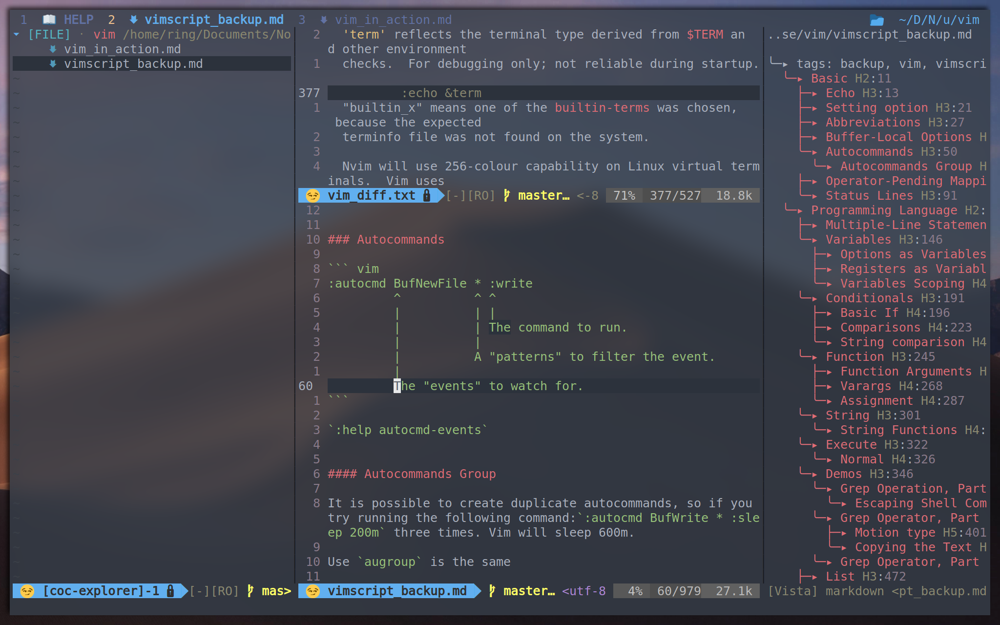

# MY VIM CONFIG FILE

- Use `i, j, k, l` to move. Swap `i` and `h`, which is more comfortablt and less conflict.
    ``` 
            ^
            i
       <j   k   l>
            v
    ```
    * `I, J, K, L` to move faster
- `<LEADER>d` to find doc
- `<LEADER>R,B,D` to run, build and debug




Pretty statusline and tabline



